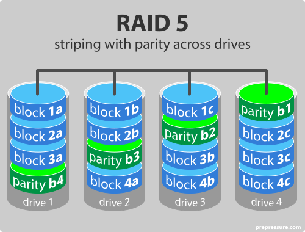

# Szoftverjog vizsga lehetséges kérdések

> [!IMPORTANT]
> A legtöbb kérdést nem a régi hanem az új jegyzetből dolgoztam ki, mivel az új jegyzetben egy picit barátibban van megfogalmazva a szöveg, mint a régiben, meg mivel ez az aktuális így remélhetőleg ezt várja el, egyébként majdnem minden ugyanúgy megtalálható a kettőben, ahol picit más vagy ellentmondás van azt jeleztem.

---

# 1. Mely szerzői jogokról lehet lemondani?
- **Felhasználási jogok**: az alkotó engedélyt adhat másoknak, hogy használhassák művét (pl. licencszerződés, Creative Commons).
- **Javítási jog**: a szerző beleegyezhet, hogy mások módosíthassák művét (pl. nyílt forráskódú szoftvereknél).
- **Terjesztési jog**: a mű másolatai szabadon terjeszthetők (pl. "copyleft" vagy Public Domain dedikálás).
- **Nyilvános közvetítés/előadás**: a szerző engedélyezheti, hogy mások előadhassák művét (pl. zenei felvételek streamelése).

**Public Domain**: A nyilvánosan hozzáférhető szoftverekre nem vonatkozik szerzői jogi védelem, és a felhasználók korlátozás nélkül használhatják, módosíthatják és terjeszthetik a szoftvert. A köztulajdonban lévő szoftverek magukban foglalhatnak olyan programokat, amelyek szerzői joga lejárt, vagy amelyeket a szerzőik vagy a szerzői jogok tulajdonosai kifejezetten köztulajdonba bocsátottak.

> [!CAUTION]
> A public domain rész az új jegyzetben van, de a többi AI válasz, mivel nem találtam egyik jegyzetben sem értelmeset ide.

---

# 2. Milyen szerepe van az informatikának a jogban?
Ahogy az információs technológia egyre terjed, a jognak alkalmazkodnia kell az olyan új szférákhoz, mint az adatfeldolgozás, a szoftverfejlesztés és a digitális kommunikáció.
### A legfontosabb jogi kérdések az IT területén:
- Adat- és információszolgáltatás szabályozása
- Adatbiztonsági követelmények (fenyegetések és ellenintézkedések)
- A szoftverhez kapcsolódó jogok és engedélyezett használat

Jogi szempontból mind a személyes adatok, mind a nyilvános információk bizonyos típusai védelmet igényelnek. A **személyes adat** egy azonosítható személyre vonatkozó minden olyan információ, amelyből az adott személyre vonatkozóan következtetéseket lehet levonni. A **közérdekű adat** a kormányzati szervek közfeladataik ellátása során birtokában lévő információ.

### Jogi szabályozások
- Hazánkban az adatok védelméről az alkotmány rendelkezik, amely szerint mindenkit megillet a jó hírnévhez, a magántitok és a személyes adatok védelméhez való jog. Magyarországon 1992-ben hirdették ki az 1992. évi LXIII. törvényt, a személyes adatok védelméről és a közérdekű adatok nyilvánosságáról 
- A szoftvereket a szerzői jog védi (1999. évi LXXVI. törvény). A szerzői jogi védelem az alkotást a szerző szellemi tevékenységéből fakadó egyéni, eredeti jellege alapján illeti meg. A védelem nem függ mennyiségi, esztétikai, minőségi jellemzőktől vagy alkotás színvonalára vonatkozó értékítélettől; de nem minden szoftver szerzői mű, csak az ahol megvan az egyéni, eredeti jelleg 

Ahogy a **mesterséges intelligencia** egyre hangsúlyosabbá válik, és egyre inkább beágyazódik a különböző ágazatokba, új szabályozások szükségesek ezen a területen. Az Európai Unió olyan mesterségesintelligencia-törvényt dolgoz ki, amely szabályokat, követelményeket és végrehajtási mechanizmusokat határoz meg az EU-n belül telepített AI-rendszerekre vonatkozóan.
  
> Az új jegyzet + régi jegyzet vegyítve.

---

# 3. Mik a társadalom érdekei az információk kezelésében?

Az információs infrastruktúra és technológia szabályozása magában foglalja a különböző érdekelt felek közötti versengő érdekeket:
- A nagy adatkezelők (cégek, hatóságok) ingyenes adatgyűjtést, integrációt, megosztást és kereskedelmi forgalomba hozatalt szeretnének.
- A polgárok szilárd személyes adatok védelmét, adatvédelmi biztosítékokat és korlátozásokat szeretnének az adatfeldolgozás/megosztás tekintetében.

> [!WARNING] 
> Új jegyzet, de nem vagyok benne biztos, hogy ide ez kell.

# 4. Ismertesse a személyes adatok kategóriáit!
A személyes adat minden olyan információ, amely valamely azonosított vagy azonosítható élő személlyel kapcsolatos. Mindazon információk, amelyek összegyűjtése egy bizonyos személy azonosításához vezethet, ugyancsak személyes adatnak minősülnek.
### Példák személyes adatokra:
- vezetéknév és utónév
- lakcím
- a `vezetéknév.utónév@vállalkozás.com` típusú e-mail-címek
- személyazonosító igazolvány száma
- helymeghatározó adatok
- IP-cím
- a telefon hirdetési azonosítója
- a személy egyedi azonosítását lehetővé tevő, kórház vagy orvos által tárolt adatok.

> Régi jegyzet.

---

# 5. Ismertesse az adatvédelem fogalmát!
Az adatvédelem a személyes adatok gyűjtésének, feldolgozásának és felhasználásának korlátozásával, az érintett személyek védelmével foglalkozik. Nevével ellentétben tehát nem elsősorban az adatokat védjük, hanem azokat a személyeket, akikkel az adatok összeköthetők. Ennek eszközei lehetnek jogi szabályok, eljárások, de akár technológiai eszközök is.

> Régi jegyzet, de teljesen ugyanígy van az újban is csak picit hosszabban.

---

# 6. Mik a felhasználó érdekei az informaciók kezelésében?
A felhasználók szilárd személyes adatok védelmét, adatvédelmi biztosítékokat és
korlátozásokat szeretnének az adatfeldolgozás/megosztás tekintetében.

> Új jegyzet.

---

# 7. Melyek a szoftverek fő kategóriái licensz szempontból?
- **Kereskedelmi**: Ezek a licencek előírják, hogy a felhasználók előzetes vagy ismétlődő díj fizetésével vásárolják meg a szoftvert. A licencszerződések jellemzően meghatározzák az engedélyezett felhasználás körét, gyakran a szerződésben meghatározott személyes vagy engedélyezett kereskedelmi célokra korlátozva. Az olyan tevékenységek, mint az újraterjesztés, módosítás vagy visszafejtés, általában tilosak a szerzői jog tulajdonosának kifejezett hozzájárulása nélkül.
- **Nyílt forrású (open source)**: A nyílt forrású szoftverek nagyon gyakran ingyenesek is, de ez nem feltétlenül igaz. Fő jellemzőjük, hogy a szoftver forráskódja elérhető, és a megszabott feltételekkel általában módosítható, továbbfejleszthető. Találhatunk megengedő és korlátozó licenszekkel rendelkező nyílt forrású szoftvereket is.
- **Freeware**: Forráskódja nem ismerhető meg.
  - **Új jegyzet**: Az ingyenes szoftvereket díjmentesen terjesztik a felhasználók számára, de a licencek jelentős korlátozásokat támasztanak, például megtiltják a szoftver kereskedelmi felhasználását, újraterjesztését vagy módosítását. Ezeket a licenceket általában személyes vagy non-profit célokra adják, és a szerzői jog tulajdonosa megtartja a teljes ellenőrzést a szoftver szellemi tulajdona felett.
  - **Régi jegyzet**: Bármely célra, korlátozás nélkül szabadon futtatható program, a felhasználó által szabadon módosítható és terjeszthető, ingyenesen beszerezhető. A szoftver díj ellenében is beszerezhető, de akkor plusz szolgáltatásokat is tartalmaz, például a szabad szoftverek összegyűjtése. A forráskód módosítható, a származék besorolását a szerző dönti el. A copyleft-tel védett származék program minden esetben megörökli az eredeti, vagyis szabad program azon tulajdonságát, hogy ez is csak free szoftver lehet. Úgy, hogy a szerzői jogi védelem nem a szerző, hanem a felhasználók jogait védi.
- **Trial/Shareware**: A próbaverziók (próbaszoftver/demoware) teljesen működőképes verziókat biztosítanak ingyenes kiértékeléshez egy korlátozott próbaidőszak alatt, amelyhez licenc vásárlása szükséges a próbaidőszak lejárta utáni folyamatos használathoz. A Shareware programok a kezdeti ingyenes terjesztés hasonló modelljét követik, de a próbaidőszak után a felhasználóknak díjat kell fizetniük a szoftver használatának folytatásához és a frissítések vagy támogatás igénybevételéhez.
- **Adware**: A reklámprogramok a működés közben a felhasználók számára megjelenített hirdetési tartalommal együtt vannak. Míg a törvényes, adware licencek korlátozásokat írhatnak elő a szoftver használatára vagy terjesztésére vonatkozóan, és egyes adware-ek etikátlan gyakorlatot folytathatnak, potenciálisan rosszindulatú programnak minősítve azokat, ha hozzájárulás nélkül gyűjtenek felhasználói adatokat vagy tolakodó hirdetéseket jelenítenek meg.

> Új jegyzet + régi jegyzet vegyítve.

> [!WARNING]
> A régi jegyzet és az új jegyzet a **Freeware** esetén eltér és ellentmondásos.

---

# 8. Mit értünk az alatt, hogy vannak korlátozó és megengedő nyílt forrású licenszek?
- **Engedélyező licencek (pl. MIT, BSD, Apache)**: Ezek a licencek minimális korlátozásokat írnak elő a felhasználók számára, lehetővé téve a nyílt forráskódú szoftverek korlátlan használatát, módosítását és újraterjesztését, beleértve a védett származékos alkotásokat is. Az elsődleges követelmény jellemzően a szerzői jogi megjegyzések és felelősségkizárások megőrzése.
- **Copyleft Licenses (pl. GPL, LGPL):** A megengedő licencek szabadságának biztosítása mellett a copyleft licencek kulcsfontosságú feltételt is tartalmaznak: a nyílt forráskódból készített bármilyen módosítást vagy származékos művet ugyanazon a néven kell terjeszteni. (vagy kompatibilis) nyílt forráskódú licencfeltételek. Ez a `copyleft` koncepció biztosítja, hogy a forráskód szabadon hozzáférhető maradjon, és megakadályozza, hogy beépüljön zárt forráskódú, védett szoftverbe.

A megengedő és a copyleft licencek közötti választásnak jelentős következményei vannak, különösen a védett szoftverprojekteken dolgozó szervezetek és fejlesztők számára. A megengedő licencek nagyobb rugalmasságot kínálnak a zárt forráskóddal való integrációhoz, míg a copyleft licencek előnyben részesítik a szoftver és származékai nyílt forráskódú jellegének fenntartását.

> Új jegyzet.

---

# 9. Mi a különség és hasonlóság a  trial és a shareware licensz között?
Mindkettőt arra tervezték, hogy a felhasználók kipróbálhassák mielőtt megvásárolnák a szoftvert.

- **Trialware**: egy teljes, de időkorlátozott verzió, ami után fizetni kell.
- **Shareware**: korlátozott funkciókkal, és a fizetés után kapod meg a teljes verziót.

> Az új jegyzet + AI.

---

# 10. Melyek az üzleti licensz fő tételei?
- **Az érintett felek**: A megállapodás azonosítja a licencadót (a szoftver kiadóját vagy a szerzői jog tulajdonosát) és a licenctulajdonost (a szoftvert megszerző felhasználót vagy entitást).
- **Használati kör**: Ez a szakasz felvázolja a szoftver megengedett használati eseteit, például személyes, kereskedelmi, oktatási vagy egyéb, a licencadó által meghatározott célokat.
- **Terjesztési jogok**: A szerződés meghatározza, hogy a licenctulajdonos jogosult-e a szoftver terjesztésére vagy újraterjesztésére, és milyen feltételek mellett (ha vannak ilyenek).
- **Módosítási jogok**: Egyes licencek feljogosíthatják a felhasználókat a szoftver kódjának módosítására vagy származékos művek létrehozására, míg mások kifejezetten megtilthatják az ilyen tevékenységeket a licencadó beleegyezése nélkül.
- **Reverse Engineering**: A megállapodás tartalmazhat olyan záradékokat, amelyek a visszafejtési tevékenységek – például a szoftver kódjának visszafordítása vagy szétszerelése – megengedhetőségére vagy korlátozásaira vonatkoznak.
- **Garancia és felelősség**: Ezek a kikötések általában magukban foglalják a szavatosság kizárását és a licencadó felelősségének korlátozását a szoftver használatából eredő károkért vagy veszteségekért.
- **Időszak és felmondás**: A szerződés meghatározza a licenc időtartamát és azokat a feltételeket, amelyek mellett bármelyik fél felmondhatja vagy megújíthatja.

> Új jegyzet.

---

# 11. Milyen módon lehet megséretni a licensz szerződést?
Például, ha egy licenc csak személyes használatot tesz lehetővé, a szoftver kereskedelmi célú használata a szerzői jogok tulajdonosának jogait sértené. További példák:
- Szoftver használata oktatási vagy intézményi környezetben, amikor a licenc csak egyéni vagy otthoni használatra vonatkozik.
- A szoftver használatának folytatása az időkorlátos vagy előfizetéses licenc lejárta után.
- Szoftverlicencek átvitele vagy viszonteladása a szerzői jog tulajdonosának beleegyezése nélkül.
- Szoftver illegális letöltése peer-to-peer hálózatokról, torrentoldalakról vagy más jogosulatlan forrásokból.
- Szerzői joggal védett szoftverprogramok megosztása vagy feltöltése a szerzői jog tulajdonosának engedélye nélkül.
- Szoftver telepítése vagy futtatása több számítógépen vagy eszközön, mint amennyit a licencszerződés megenged.
- Szoftvertelepítő lemezek vagy fájlok másolása és terjesztése engedély nélkül.

> Új jegyzet.

---

# 12. Mely szerzői jogok örökölhetők?
A vagyoni jogok örökölhetők a szerző halála esetén.

A vagyoni jogokra vonatkozó általános szabályok: a szerzőt kizárólagos jog illeti meg, hogy a mű által keletkezett anyagi vagy nem anyagi haszon felett rendelkezzen. Amennyiben a mű egészét vagy részeit felhasználják, a díj a szerzőt illeti, erről csak nyilatkozattal mondhat le. Jogosulatlan kezelésről beszélünk, ha a szerző nem ad engedélyt a mű felhasználására vagy a felhasználó túllépi a felhasználás feltételeit.

> Régi jegyzet.

---

# 13. Mit tud a BSA-ról?
Az illegális szoftverhasználat ellen Magyarországon a rendőrség léphet fel, de a rendőrségnek nincs mindig elegendő kapacitása vagy szakértelme a szükséges vizsgálatok lefolytatására, így szükségessé vált egy olyan szervezet megalakulása, amely céljául tűzte ki az illegális szoftverhasználat elleni harcot. Az illegális szoftverhasználat visszaszorításának érdekében jött létre a **BSA (Business Software Alliance)**, a világ 60 országában működő nemzetközi szervezet, amely magyarországi képviselettel is rendelkezik.

A BSA nem karhatalmi szervezet, hanem egy olyan szervezet, amely a szoftverek jogszerű felhasználása érdekében gondoskodik a felhasználók és a szoftverjogvédelemmel kapcsolatban eljáró intézmények, hatóságok (ORFK, NAV, VPOP) tájékoztatásáról, számukra tanácsadói, szakértői segítséget biztosít.

> Régi jegyzet.

---

# 14. Ismertesse a RAID-1 technológiát!
A RAID 1 egy egyszerű tükrözési konfiguráció, ahol az adatok két vagy több lemezre azonos módon kerülnek kiírásra. Ez a szint kiváló hibatűrést biztosít, mivel az adatok továbbra is elérhetők a fennmaradó tükrözött lemez(ek)ről, ha az egyik lemez meghibásodik. A RAID 1 nagy adatredundanciát kínál, de csökkentett tárolókapacitás ára, mivel a teljes használható kapacitás megegyezik a tömbben lévő egyetlen lemez méretével.

    

> Új jegyzet.

---

# 15. Ismertesse a RAID-5 technológiát!
A RAID-5 (Osztott paritás) a legelterjedtebb megoldási mód. Olyan mintha  a RAID 0-hoz adalékolnánk egy hibajavító információt.

A RAID 5-ben az adatok több lemezen vannak csíkozva, és a paritásinformációk (a hibaellenőrzésre és helyreállításra használt redundáns adatok) a tömb összes lemezén el vannak osztva. Ez a konfiguráció lehetővé teszi az egylemezes hibák helyreállítását, mivel a hiányzó adatok a fennmaradó adatokból és paritásinformációkból rekonstruálhatók.

A megvalósításhoz legalább három darab HDD-re van szükségünk. Most nézzünk pédát 4 db HDD-re, mint az ábrán. A RAID tömb felépítésének, azaz az adatokfelírásának az a lényege, hogy  az első adatblokk kerül az első lemezre, a második a másodikra,  a harmadik a harmadikra és a háromból képzett hibajavító kód (ECC - Error Correction Code) a negyedikre. A következő körben az első adatblokk az első lemezre, a második a másodikra, a hibajavító kód a harmadikra és a harmadik adatblokk a negyedikre és így tovább.

    

> Az új jegyzet + régi jegyzet vegyítve.

> [!CAUTION]
> A dc-re beküldött kérdéseknél csak a RAID-5 meg RAID-1 volt benne, de a többit is kérdezheti valószínűleg.

---

# 16. Ismertesse a monitorozást / naplózást, mint felügyeleti módszert!
### Új jegyzet
Folyamatosan figyeli a felhőalapú erőforrásokat, konfigurációkat és felhasználói tevékenységeket a potenciális biztonsági fenyegetések szempontjából, valamint naplókat gyűjt és elemez az incidensek kivizsgálásának és reagálásának támogatása érdekében.

### Régi jegyzet
A monitorozás valamely „helyzet” megfigyelése, mely során az időbeni változásokat kívánjuk érzékelni. A monitorozás egy folyamatos, aktuális állapotképet tart fel a rendszerünkről. A monitorozás sokféle jellemzőre kiterjedhet:
- egy adott komponens vagy a rendszer normális vagy attól eltérő tevékenysége,
- teljesítménye és kihasználtsága,
- nem engedélyezett változtatása, stb.

> Az új jegyzet + régi jegyzet vegyítve.

> [!WARNING]
> A régi jegyzetben még jobban ki van fejtve a monitorozás, de szerintem olyan szinten nem kell, viszont érdemes lehet legalább 1x átnézni.

---

# 17. Mi a digitális tanusítvány, hogyan segíti a kommunikáció megbízhatóságát?
A digitális tanusítvány egy elektronikus dokumentum, amely hitelesíti egy entitás (pl. szerver, felhasználó, vállalat) nyilvános kulcsát, és megerősíti annak identitását. A digitális tanusítványokat megbízható harmadik félként működő Tanúsítványkiadó Hatóságok (CA – Certificate Authority) állítják ki, és digitális aláírással védik.

> AI, de a jegyzetekben is hasonlóan van leírva csak mindig az aláíráshoz kötve...

---

# 18. Hogyan működik a HTTPS protokoll (lépések)?
A HTTPS a HTTP biztonságos változata, amely titkosítást használ a webböngésző és a webszerver közötti kommunikáció védelmére.

### Lépések
- Kapcsolatfelvétel: A kliens (böngésző) kapcsolatot kér a szerverrel a 443-as porton.
- TLS/SSL kézfogás (handshake): 
  - a. A kliens és szerver megegyeznek a protokoll verzióban és titkosítási algoritmusokban. 
  - b. A szerver elküldi a CA által hitelesített tanúsítványát a kliensnek, amely tartalmazza a szerver publikus kulcsát. A kliens a CA publikus kulcsával ellenőrzi a tanúsítvány aláírását. 
  - c. A kliens generál egy saját aszimmetrikus kulcspárt és elküldi a publikus kulcsát a szervernek. A kliens elkészíti a közös titkos kulcsot, majd a szerver publikus kulcsával titkosítva elküldi azt a szervernek. A szerver a saját privát kulcsával dekódolja a beérkező titkos kulcsot, így mindkét fél rendelkezik a közös titkos kulccsal.
  - d. A kliens és szerver megegyeznek az üzenet hitelesítő kód algoritmusban és elkezdik titkosítani az adatokat a közös titkos kulccsal.
- Biztonságos HTTP kommunikáció: A kézfogás után a kliens és a szerver szimmetrikus titkosítással kommunikálhatnak egymással, amely garantálja az adatok integritását, hitelességét és bizalmas voltát.

> Régi jegyzet (PPT).

---

# 19. Hogyan működik a digitális aláírás (lépések)?
A digitális aláírások olyan kriptográfiai mechanizmusok, amelyek lehetővé teszik a digitális
üzenetek vagy dokumentumok hitelesítését, biztosítva azok integritását és
letagadhatatlanságát. A digitális aláírások nyilvános kulcsú kriptográfián alapulnak, és
biztonságos módot nyújtanak az aláíró személyazonosságának ellenőrzésére, valamint annak
biztosítására, hogy az aláírt tartalom nem változott-e meg

### Lépések
1. az aláírandó adatokból elkészül annak fix (általában 160–512 bit) hosszúságú kivonata
2. a kivonatot az aláíró algoritmus és a titkos kulcs segítségével rejtjelezi az alkalmazás, és ez lesz a digitális aláírás
3. az aláírás kezdeti ellenőrzése automatikusan megtörténik
4. a digitális aláírás az adatokhoz csatolva eljut a fogadóhoz

### Aláíró algoritmusok
- **RSA**: A széles körben használt RSA algoritmus a nagy prímszámok faktorálásának nehézségén alapul, és általában digitális aláírásra és titkosításra használják.
- **DSA**: A Digital Signature Algorithm (DSA) a digitális aláírások szövetségi szabványa, amely a moduláris hatványozás matematikai koncepcióján és a diszkrét logaritmus probléma megoldhatatlanságán alapul.
- **ECDSA**: Az Elliptic Curve Digital Signature Algorithm (ECDSA) a DSA egy olyan változata, amely elliptikus görbecsoportokon működik, kisebb kulcsméreteket és gyorsabb számításokat kínál az RSA-hoz és a DSA-hoz képest.
- **PKCS#7/CMS**: A nyilvános kulcsú titkosítási szabványok (PKCS) #7 és a kriptográfiai üzenetek szintaxisa (CMS) határozzák meg a digitálisan aláírt adatok és tanúsítványok formátumait.

> Az új jegyzet + régi jegyzet vegyítve.

---

# 20. Hogyan működik a digitális aláírás időbélyegzés (lépések)?
Az időbélyegek egy digitális esemény vagy tranzakció dátumának és időpontjának rögzítésére
szolgálnak, bizonyítékot szolgáltatva annak bekövetkeztére és integritására. Az időbélyegeket
gyakran a digitális aláírásokkal együtt használják az elektronikus dokumentumok vagy
tranzakciók érvényességének és hitelességének megállapítására.

### Lépések
1. Az aláírandó dokumentum hash értékét elkészítjük.
2. Az időbélyegző szolgáltató (TSP) digitális aláírást készít a hash értékről, amely tartalmazza a TSP azonosítóját, az időbélyegző időpontját és a hash értéket.
3. Az időbélyegzőt a dokumentumhoz csatoljuk, amely tartalmazza a hash értéket és a TSP digitális aláírását.
4. Az időbélyegzőt a dokumentumhoz csatolva elküldjük a címzettnek, aki ellenőrizheti az aláírást és az időbélyegző érvényességét.

> Az ú jegyzet + régi jegyzet vegyítve.

> [!CAUTION]
> Egyik jegyzet sem tartalmazza a lépéseit, szóval az AI.
